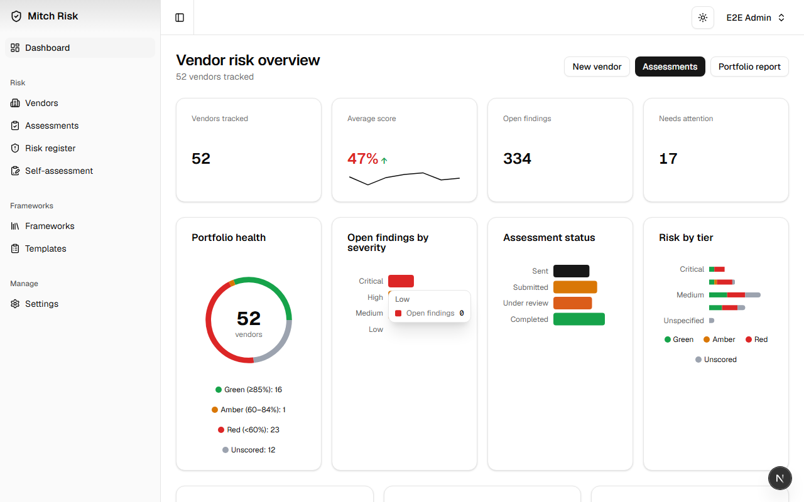
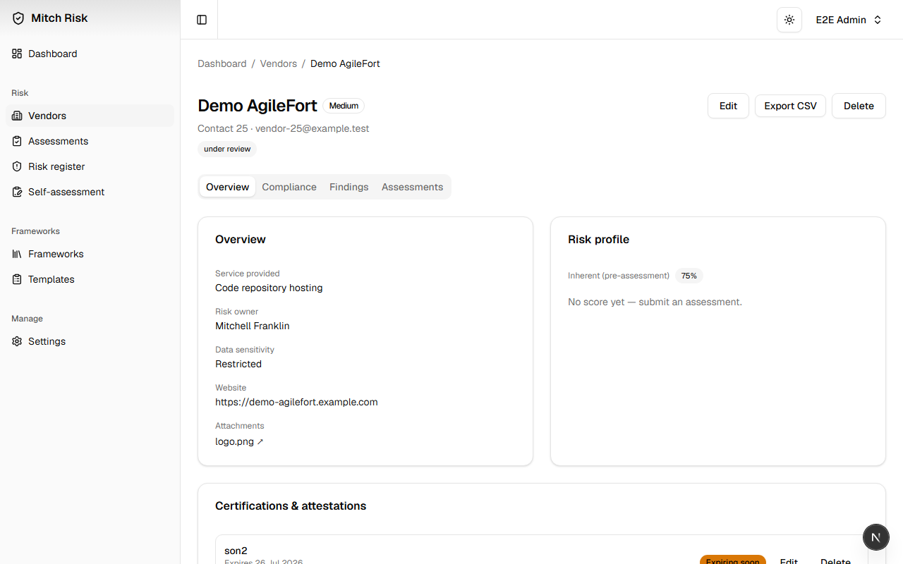
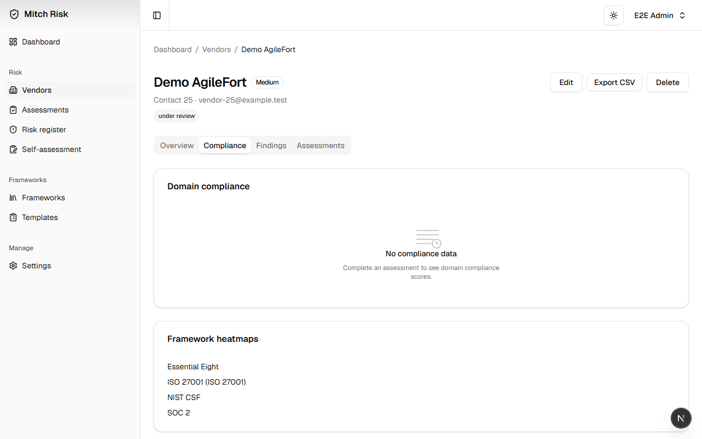
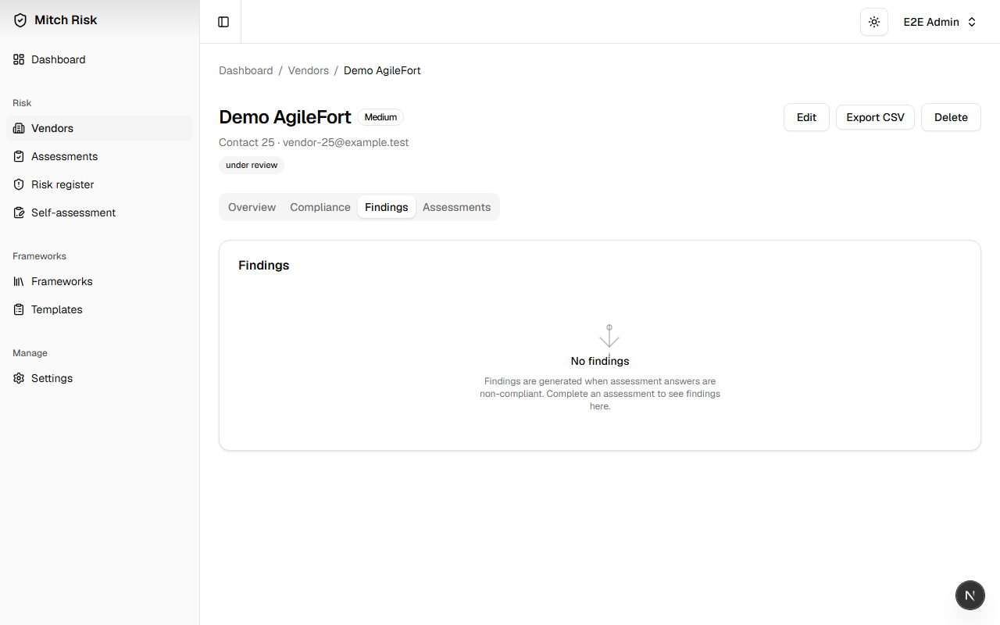
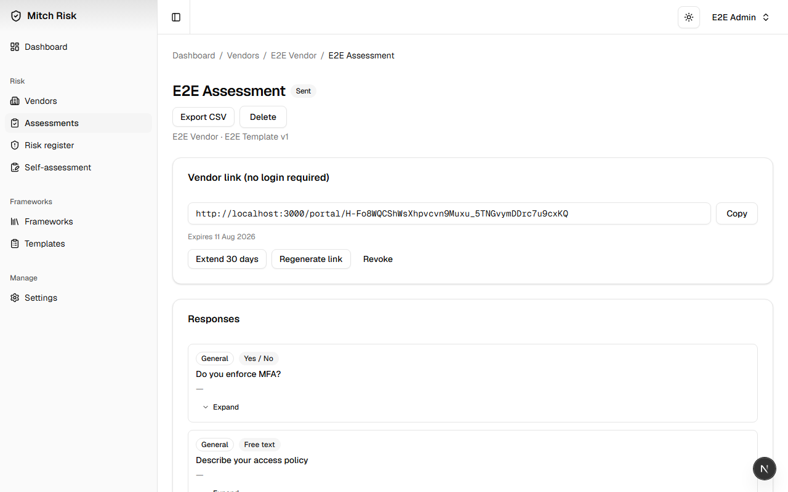
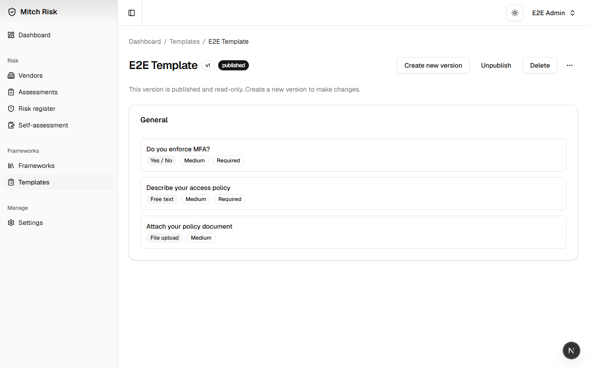
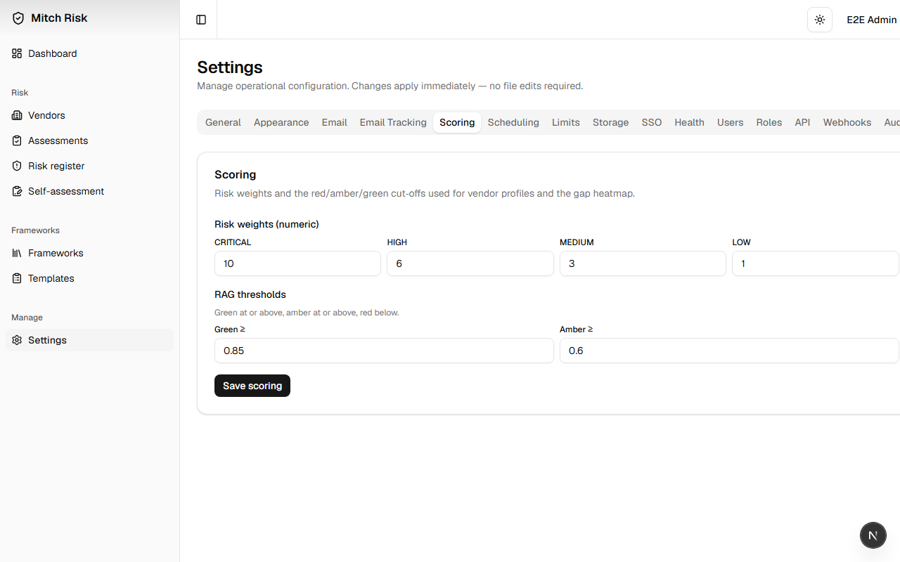

# Screenshots

## Dashboard

The dashboard provides a portfolio-level view with animated stat cards, a donut chart of vendor risk distribution, a bar chart of findings by severity, and an interactive assessment activity timeline. The **Needs attention** card shows actionable summary pills (unreviewed submissions, clarifications, failed emails) alongside expandable groups for overdue assessments, below-threshold vendors, and key dates.

## Vendor Detail

The vendor detail page uses a tabbed layout to organise profile information, risk scores, compliance data, findings, and assessment history into four focused views.

### Overview

The Overview tab shows vendor profile fields alongside the risk profile card — inherent (pre-assessment) and residual (assessed) scores, overall score with trend direction, and an interactive score history bar chart. Certifications and attestations are managed below.

### Compliance

The Compliance tab displays domain-level compliance bars with RAG-coloured progress indicators, computed from the vendor's latest completed assessment. Links to per-framework control heatmaps provide drill-down into individual control compliance.

### Findings

The Findings tab lists all findings for the vendor with severity and status badges, linked to their source assessments. An open findings count badge on the tab trigger provides an at-a-glance indicator of outstanding issues.

## Assessment Review

The assessment review screen displays the vendor's questionnaire responses alongside the scoring panel. Reviewers can approve, reject, or request clarification on each answer. A collapsible review panel tracks decisions in context, and threaded comments support vendor collaboration.

## Template Builder

Templates define the questionnaire structure — sections, questions, answer types, risk weights, expected answers, and conditional logic. Twelve question types are supported, including multiple choice, checkboxes, numeric ranges, free text, and file uploads. Templates can be versioned, published, and unpublished.

## In-App Settings

All operational configuration is managed through the Settings interface. This includes scoring weights and RAG thresholds, email delivery and templates, user roles and permissions, API key management, SSO provider configuration, storage backend selection, and brand customisation.

